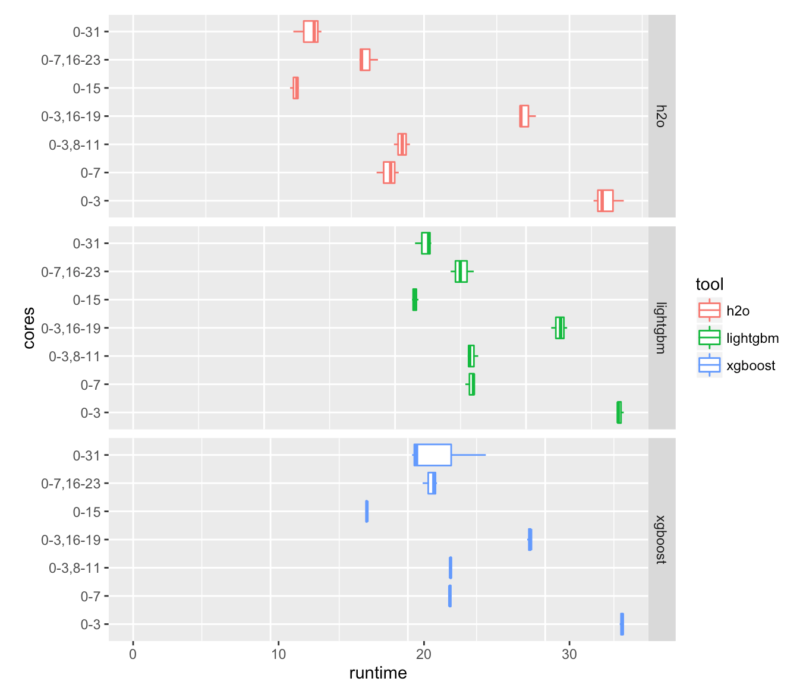
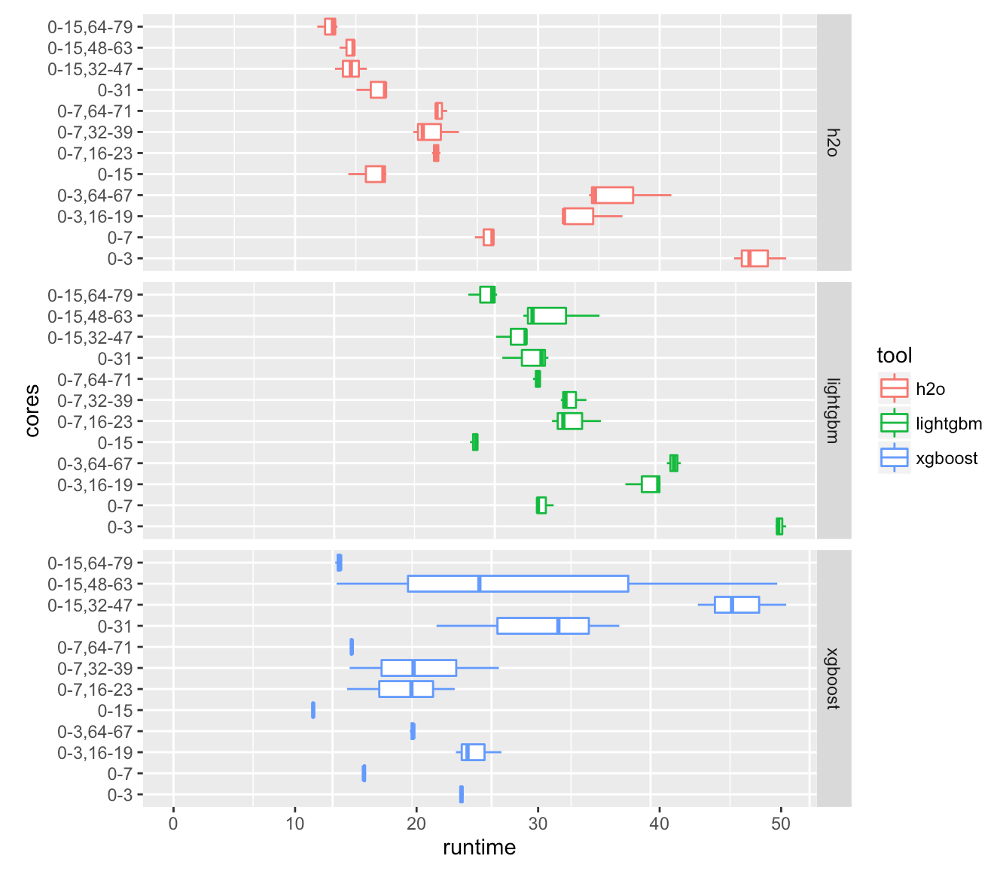
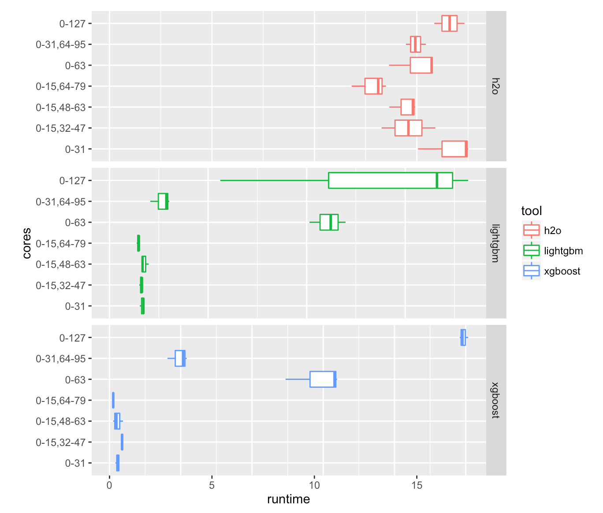
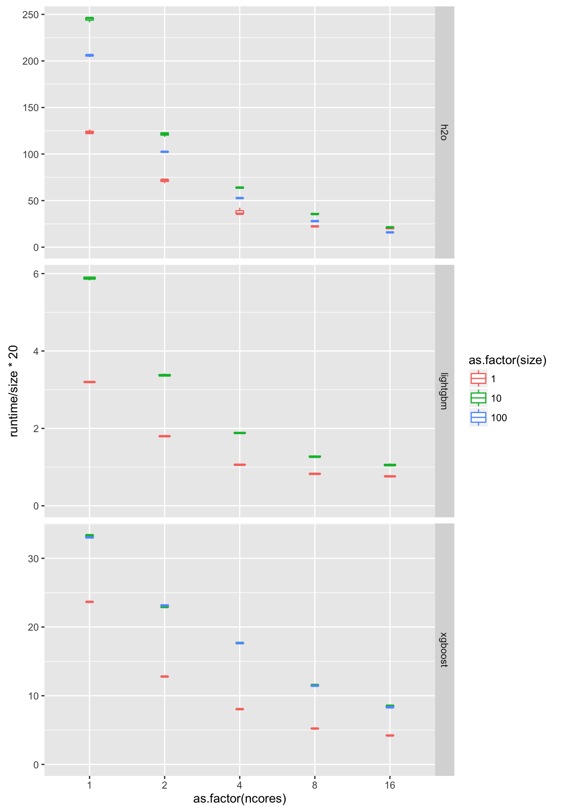
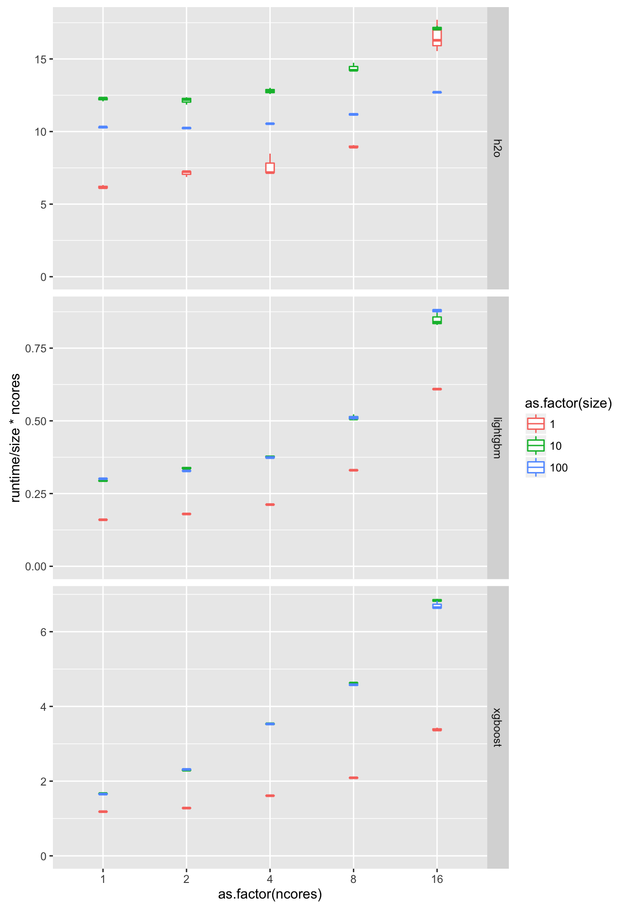
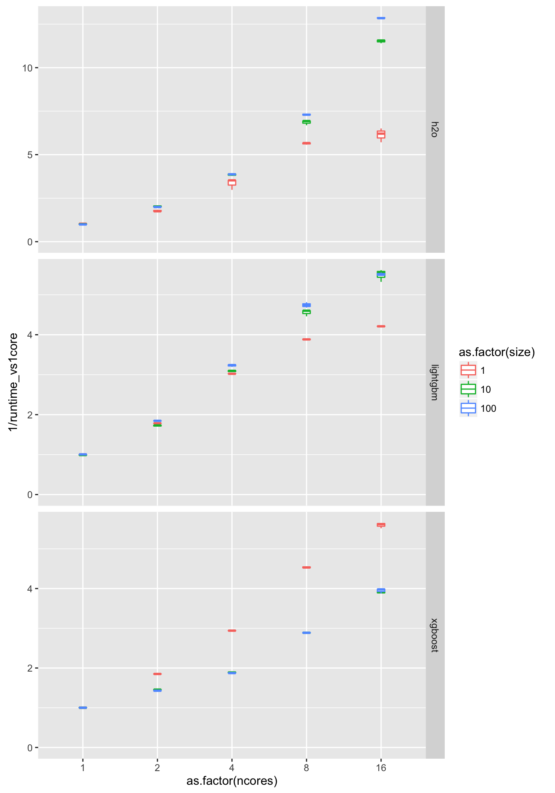

# GBM multicore scaling

## h2o, xgboost and lightgbm on multicore and multi-socket systems

Despite the deep learning hype, on most supervised learning problems with tabular data 
(commonly encountered in business) gradient boosting machines (GBMs) are often the
winning single-algorithm solution (winning in accuracy).

The 3 best (in speed, memory footprint and accuracy) open source implementations for GBMs 
are xgboost, h2o and lightgbm (see [benchmarks](https://github.com/szilard/benchm-ml)).

In this repo I'll take a look at the scalability of h2o, xgboost and lightgbm as a function
of the number of CPU cores and sockets on various Amazon EC2 instances. 
Previous [experiments](https://github.com/szilard/ml-x1) have shown significant slow-down
of xgboost on multi-socket systems.

## Multi-socket systems

These experiments are using a 10-million-record dataset.

### r3.8xlarge (32 cores)

r3.8xlarge has 2 CPU sockets with 8+8 hyperthreaded cores each.
Cores 0-7 are on CPU1, 8-15 on CPU2, then 16-23 are hyperthread pairs of 0-7 etc.

Relative training times:

Contrary to the [previous results](https://github.com/szilard/ml-x1)
(with previous versions of xgboost), having 2 CPU sockets
causes little or no degradation of runtime for all 3 software tools, 
see e.g. the `0-7` vs `0-3,8-11` results. 

However, by adding hyperthreaded (HT) cores one gets only a partial speedup (vs adding "real" cores),
see e.g. `0-3` to `0-3,16-19` (HT) vs `0-3` to `0-7` results (with all tools).

When all cores are used adding the last HT cores can actually hurt performance (most significantly
xgboost is faster on 15 cores than 32 cores).

### x1.32xlarge (128 cores)

x1.32xlarge has 4 CPU sockets with 16+16 hyperthreaded cores each. Cores 0-15 are on CPU1, 16-31 on CPU2 etc., then 64-79 are hyperthread pairs of 0-15 etc.

Relative training times:

In view of the above results on r3.8xlarge this is unexpected. Running on multiple sockets/NUMA nodes slows down all
3 tools, e.g. `0-3,16-19` is slower vs `0-7`, and `0-7,16-23` is slower than `0-15`. 

For more than 15 cores (the number of "real" cores on a socket), xgboost and lightgbm slows down, while h2o only gains
a little bit of speed.

On high number of cores (64/128) xgboost and lightgbm become very slow and runtimes show very high variability as
well (not sure what's going on on those interconnects, maybe also effects of virtualization on AWS). 
For example on 128 cores, lightgbm runtimes in 3 runs were 6.6, 2.2 and 7.2 seconds, respectively.

### Other AWS instances

Experiments with m4.16xlarge (64 cores, 2 sockets), c4.8xlarge (36 cores, 2 sockets), r4.16xlarge (64 cores, 2 sockets) and 
x1.16xlarge (64 cores, 2 sockets) show results similar to x1.32xlarge that is lightgbm and xgboost slow down on more 
than 1 socket. 

The best performance for lightgbm and xgboost is if restricted to 1 socket and 16 "real" cores, no hyperthreading.
Fastest training for all 3 tools is on r4.8xlarge (32 cores, 1 socket) restricted to 16 "real" cores:

Tool      |   Time [s] 
----------|-------------
xgboost   |    4
lightgbm  |    0.5
h2o       |    10

Nevertheless, one can still take advantage of more cores on a system by placing for example different cross validation
folds or different runs in a grid/random hyperparameter search on the different sockets.

**TODO:** Do above on physical servers (to rule out virtualization effects, though it seems the root cause of the above
behavior is cache invalidation and the interconnect).

## Single socket (multicore) scaling

We measure training time vs number of cores and dataset size on a single socket system (r4.8xlarge, 16 "real" cores) for
1,2,4,8,16 cores and datasets of 1,10,100 million records. 
Details [here](single_socket).

Training time normalized with dataset size:

Training time normalized with dataset size and number of cores:

Training speed (`1/time`) normalized with 1-core training time for given tool and dataset size:

The scaling as a function of number of cores is worse than linear (as expected). 
For example lightgbm on 10M records:

n_cores | speed
--------|----------
2       | 1.8x
4       | 3x
8       | 5x
16      | 6x

However, one could expect linear or better than linear scaling as a function of dataset size (if various overheads become
relatively smaller for larger datasets). Contrary, we see worse than linear scaling from 1M to 10M, I think due to CPU cache
effects (smaller datasets fit better/longer in CPU caches), and then linear (xgboost and lightgbm) or better than linear (h2o) scaling from 10M to 100M. 

As a combination of the above 2 effects one can get this much faster training with 16 cores (vs 1):

Tool      |   1M data   | 10M/100M  
----------|-------------|------------
lightgbm  |    4x       |     6x
xgboost   |    6x       |     4x
h2o       |    6x       |     12x

